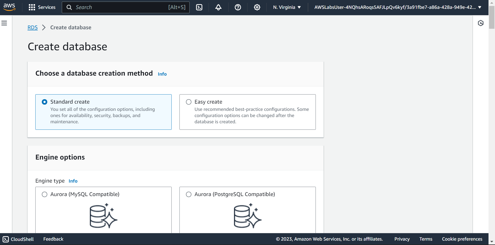
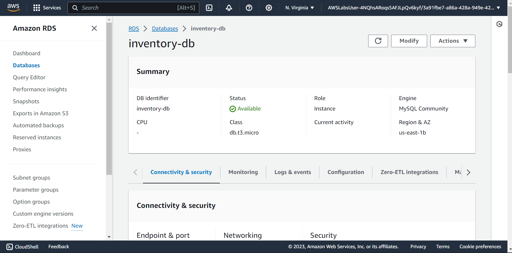

## Task 1: Creating an Amazon RDS database
In this task, you create a MySQL database in your virtual private cloud (VPC). MySQL is a popular open-source relational database management system (RDBMS), so there are no software licensing fees.

On the Services  menu, choose RDS.
Choose Create database
For this lab, you will keep the Choose a database creation method as Standard create to understand the full set of features available.

Under Engine options, select  MySQL.\
For Version, keep MySQL 8.0.28.
In the options, you might notice Amazon Aurora. Aurora is a global-scale relational database service built for the cloud with full MySQL and PostgreSQL compatibility. If your company uses large-scale MySQL or PostgreSQL databases, Aurora can provide enhanced performance.
```
MySQL version 8.0.28
```

In the Templates section, select  Dev/Test (This instance is intended for development use outside of a production environment).\
You can now select a database configuration, including software version, instance class, storage, and login settings. The Multi-AZ deployment option automatically creates a replica of the database in a second Availability Zone for high availability.\

In the Availability and durability section, choose Single DB instance

In the Settings section next, configure the following options:
```
DB instance identifier: inventory-db

Master username: admin

Master password: lab-password
Confirm password: lab-password
```
- Note: Please use these values verbatim, do not make any changes.

In the Instance configuration section, configure the following options for DB instance class:
Choose  Burstable classes (includes t classes).
```
Choose db.t3.micro.
```
In the Storage section next,
For Storage type choose General Purpose SSD (gp2) from the Dropdown menu.
For Allocated storage keep 
```
20
```
Clear or Deselect Enable storage autoscaling.

In the Connectivity section, configure the following options:

For Compute resource
keep default  Don’t connect to an EC2 compute resource, as you will establish this manually at a later stage.
For Virtual private cloud (VPC) Choose Lab VPC from the Dropdown menu.
For DB Subnet group, keep default value rds-lab-db-subnet-group
For Public access Keep default value (No)
For VPC security group (firewall)
Choose the X on default to remove this security group.
Choose DB-SG from the dropdown list to add it.
For Availability Zone, Keep default No preference
For Database authentication keep default value  Password authentication\
In the Monitoring section
Clear/DeSelect the  Enable Enhanced monitoring option.
Expand the following Additional configuration section by choosing

Under Database options, for Initial database name, enter 
```
inventory
```
- This is the logical name of the database that the application will use.

 You can review the few other options displayed on the page, but leave them set to their default values. Options include automatic backups, Log exports, Encryption and automatic version upgrades. The ability to activate these features with check boxes demonstrates the power of using a fully managed database solution instead of installing, backing up, and maintaining the database yourself.

At the bottom of the page, choose Create database
You should receive this message: Creating database inventory-db.

 If you receive an error message that mentions rds-monitoring-role, confirm that you have cleared the Enable Enhanced monitoring option in the previous step, and then try again.

Before you continue to the next task, the database instance status must be Available. This process could take several minutes.



- Connection details to your database inventory-db
```
Endpoint: inventory-db.c5igswdip1qh.us-east-1.rds.amazonaws.com
Master username: admin
Master password: lab-password
```

