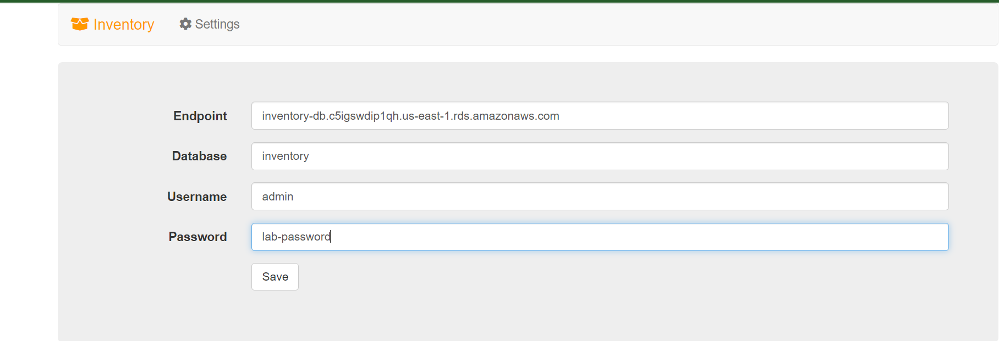
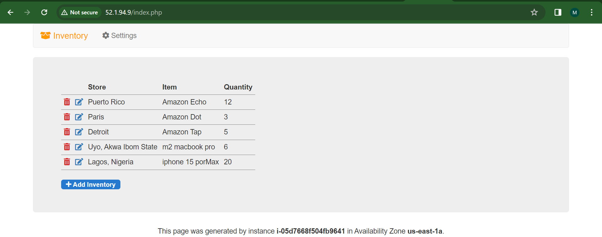

## Task 1: Creating an Amazon RDS database
In this task, you create a MySQL database in your virtual private cloud (VPC). MySQL is a popular open-source relational database management system (RDBMS), so there are no software licensing fees.

On the Services  menu, choose RDS.
Choose Create database
For this lab, you will keep the Choose a database creation method as Standard create to understand the full set of features available.

Under Engine options, select  MySQL.\
For Version, keep MySQL 8.0.28.
In the options, you might notice Amazon Aurora. Aurora is a global-scale relational database service built for the cloud with full MySQL and PostgreSQL compatibility. If your company uses large-scale MySQL or PostgreSQL databases, Aurora can provide enhanced performance.
```
MySQL version 8.0.28
```

In the Templates section, select  Dev/Test (This instance is intended for development use outside of a production environment).\
You can now select a database configuration, including software version, instance class, storage, and login settings. The Multi-AZ deployment option automatically creates a replica of the database in a second Availability Zone for high availability.\

In the Availability and durability section, choose Single DB instance

In the Settings section next, configure the following options:
```
DB instance identifier: inventory-db

Master username: admin

Master password: lab-password
Confirm password: lab-password
```
- Note: Please use these values verbatim, do not make any changes.

In the Instance configuration section, configure the following options for DB instance class:
Choose  Burstable classes (includes t classes).
```
Choose db.t3.micro.
```
In the Storage section next,
For Storage type choose General Purpose SSD (gp2) from the Dropdown menu.
For Allocated storage keep 
```
20
```
Clear or Deselect Enable storage autoscaling.

In the Connectivity section, configure the following options:

For Compute resource
keep default  Don’t connect to an EC2 compute resource, as you will establish this manually at a later stage.
For Virtual private cloud (VPC) Choose Lab VPC from the Dropdown menu.
For DB Subnet group, keep default value rds-lab-db-subnet-group
For Public access Keep default value (No)
For VPC security group (firewall)
Choose the X on default to remove this security group.
Choose DB-SG from the dropdown list to add it.
For Availability Zone, Keep default No preference
For Database authentication keep default value  Password authentication\
In the Monitoring section
Clear/DeSelect the  Enable Enhanced monitoring option.
Expand the following Additional configuration section by choosing

Under Database options, for Initial database name, enter 
```
inventory
```
- This is the logical name of the database that the application will use.

 You can review the few other options displayed on the page, but leave them set to their default values. Options include automatic backups, Log exports, Encryption and automatic version upgrades. The ability to activate these features with check boxes demonstrates the power of using a fully managed database solution instead of installing, backing up, and maintaining the database yourself.

At the bottom of the page, choose Create database
You should receive this message: Creating database inventory-db.

 If you receive an error message that mentions rds-monitoring-role, confirm that you have cleared the Enable Enhanced monitoring option in the previous step, and then try again.

Before you continue to the next task, the database instance status must be Available. This process could take several minutes


- Connection details to your database inventory-db
```
Endpoint: inventory-db.c5igswdip1qh.us-east-1.rds.amazonaws.com
Master username: admin
Master password: lab-password
```

## Task 2: Configuring web application communication with the database instance
This lab automatically deployed an Amazon Elastic Compute Cloud (Amazon EC2) instance with a running web application. You must use the IP address of the instance to connect to the application. I this task, you will use application to configure connection settings which will be stored in AWS Secrets Manager for further use.

On the Services  menu, choose EC2.
In the left navigation pane, choose Instances.
In the center pane, there should be a running instance that is named App Server.

Select the check box for the App Server instance.

In the Details tab, copy the Public IPv4 address to your clipboard.

Tip: You can choose copy  to copy the displayed value the displayed value.

Open a new web browser tab, paste the IP address into the address bar, and then press Enter.
The web application should appear. It does not display much information because the application is not yet connected to the database.

Choose  Settings.

DB app server accessed over the web browser using 
```
public ip: 52.1.94.9
```
You can now configure the application to use the Amazon RDS database instance that you created earlier. You first retrieve the database endpoint so that the application knows how to connect to a database.

Return to the AWS Management Console, but do not close the application tab. (You will return to it soon).

On the Services  menu, choose RDS.

In the left navigation pane, choose Databases.

Under DB identifier, Choose ‘inventory-db’.

From the Connectivity & security section, copy the Endpoint to your clipboard.

It should look similar to this example: inventory-db.crwxbgqad61a.rds.amazonaws.com

Return to the browser tab with the inventory application, and enter the following values:

```
For Endpoint, paste the endpoint you copied earlier: inventory-db.c5igswdip1qh.us-east-1.rds.amazonaws.com

For Database, enter: inventory
For Username, enter: admin
For Password, enter: lab-password
```
Choose Save.

The application will now Save this information into **AWS Secrets Manager ** and connect to the database, load some initial data, and display information.

You can use the web application to  Add inventory,  edit, and  delete inventory information.
The inventory information is stored in the Amazon RDS MySQL database that you created earlier in the lab. This means that any failure in the application server will not lead to loss of any data. It also means that multiple application servers can access the same data.

Insert new records into the table. Ensure that the table has 5 or more inventory records.
 You have now successfully launched the application and connected it to the database.

Optional: To access the saved parameters, go to the AWS Management console. On the Services  menu, choose Secrets Manager , choose Secrets.